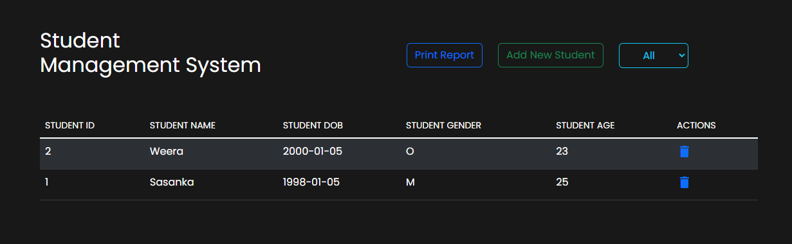
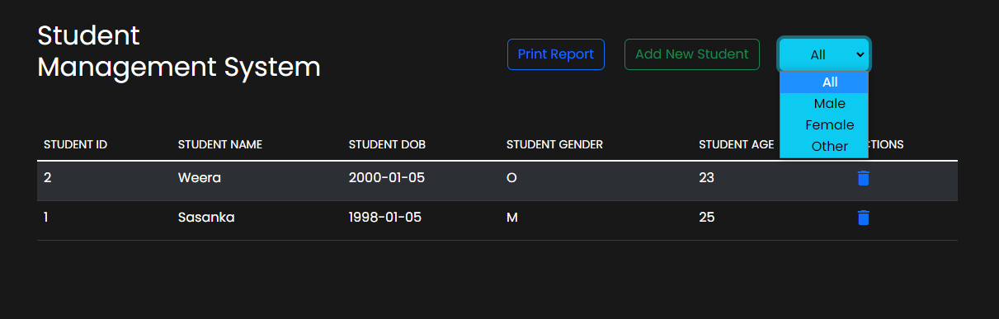
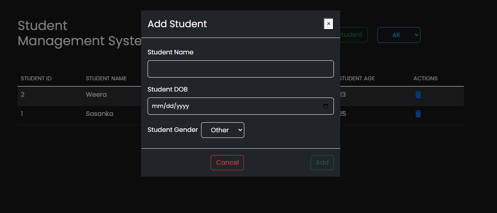
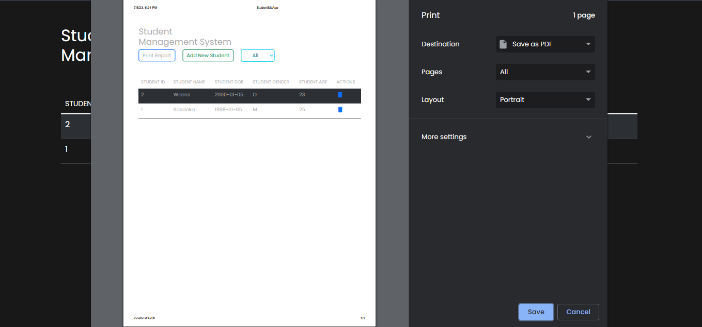

# Student_MS

Student Management System is also known as a Student Information System (SIS). These systems work to coordinate scheduling and communications between faculty regarding students. This system exists to simplify information tracking for both parents and administrative staff.

Front End generated with [Angular CLI](https://github.com/angular/angular-cli) version 16.1.0.
- Typescript
  - enum
  - interface
  - service
  - app.component
- HTML
- CSS
  - [Bootstrap](https://getbootstrap.com/)

This Project have capabilities of 
- Adding new Student 
- Delete Student 
- Print the Student List 
- Filter By Gender

## Development server

Run `ng serve` for a dev server. Navigate to `http://localhost:4200/`. The application will automatically reload if you change any of the source files.

`ng serve --open`

## Further help

To get more help on the Angular CLI use `ng help` or go check out the [Angular CLI Overview and Command Reference](https://angular.io/cli) page.

## LICENSE

